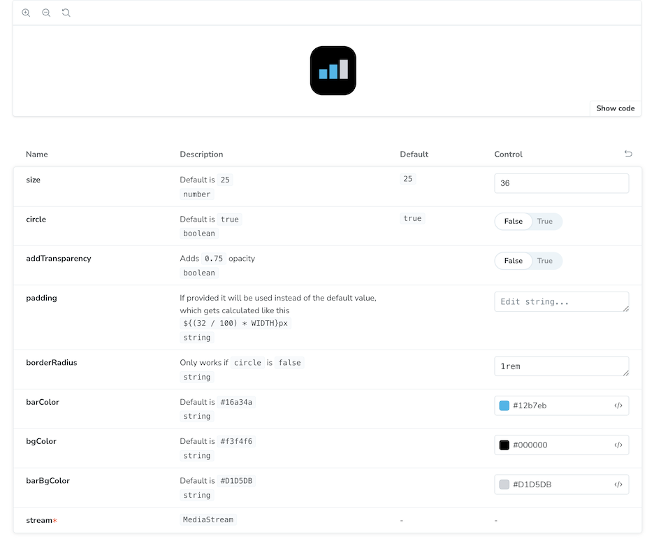

## react-mic-visualizer - DELETED

### Deleted the package - not very useful.

React mic/audio visualizer component.

<br />


#### Basic example

```js
import { BarVisualizer } from 'react-mic-visualizer';

const [stream, setStream] = useState<MediaStream | null>(null);

useEffect(() => {
  navigator.mediaDevices.getUserMedia({ audio: true }).then((stream) => {
    setStream(stream);
  });
}, []);

return stream ? <BarVisualizer stream={stream} /> : null;
```

### Props

| Prop | Description   | Default  | Required |
| ---- | ------------- | -------- | -------- |
| `stream` | [`MediaStream`](https://developer.mozilla.org/en-US/docs/Web/API/MediaStream) | - | `Yes` |
| `size` | Size of the visualizer | `25` | No |
| `circle` | Whether to use circle visualizer | `true` | No |
| `addTransparency` | Pass this prop to make the visualizer transparent. Adds `0.75` opacity. | `false` | No |
| `padding` | If provided it will be used instead of the default value, which gets calculated like this `${(32 / 100) * WIDTH}px` | - | No |
| `borderRadius` | Only works if `circle` is `false` | - | No |
| `bgColor` | Background color | `#f3f4f6` | No |
| `barBgColor` | Bar background color | `#D1D5DB` | No |
| `barColor` | Bar color | `#16a34a` | No |

### Play and test

```
npm run storybook
```

<br />


